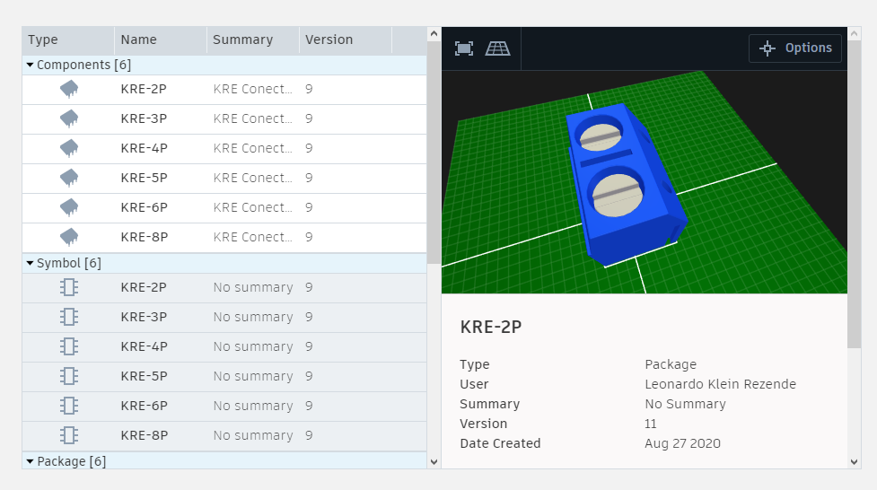
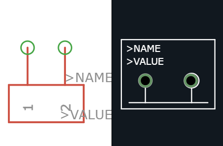
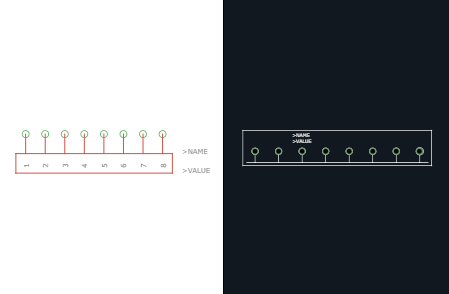
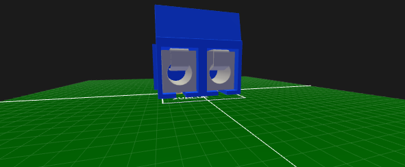
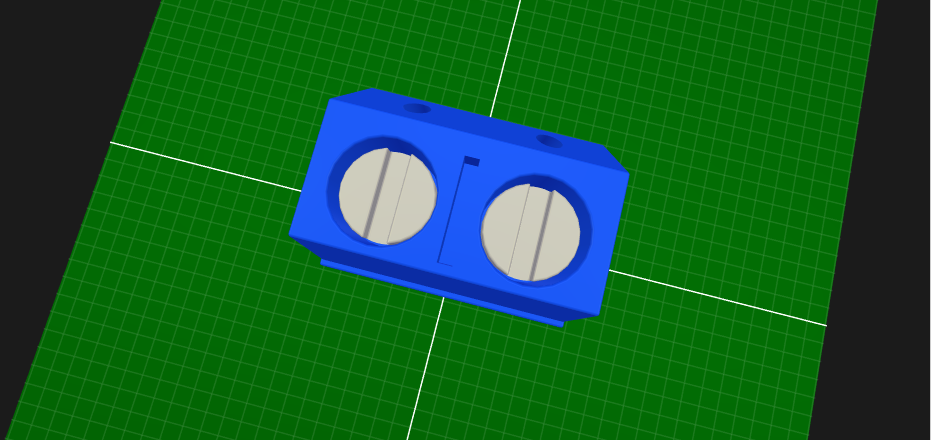
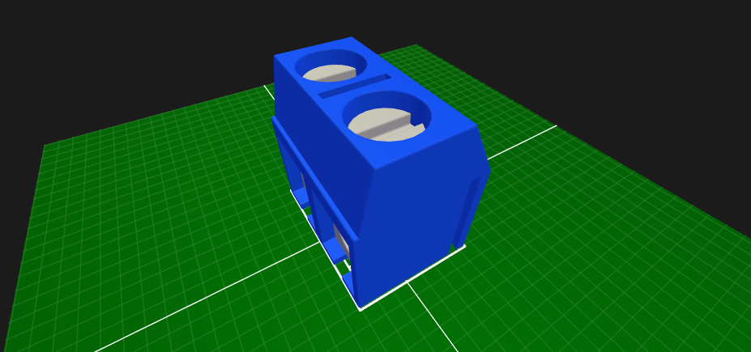

# eagle-bibliotecas-3d
Bibliotecas Eagle simplificadas com modelos 3D. As bibliotecas estão o mais genéricas possíveis, então particularidades específicas de alguns fabricantes podem não estar previstas. Recomendo a medir os componentes de ante-mão caso os tenha, ou pesquisar na internet as dimensões de cada um para projetar com mais precisão.

## Resumo

##### Feitas ou em andamento:
- [x] Conectores KRE
- [x] LED
- [ ] Display 7-SEG
- [ ] Resistores
- [ ] Capacitores
- [ ] Buttons and Switches
- [x] Soquetes DIP e ICs
- [x] Pin Headers
- [ ] Válvulas e Soquetes
- [ ] Potenciômetros

### Conectores KRE 

##### Amostra de símbolo, footprint e pacote 3D (agradecimentos e créditos à Dragos Ionescu pelo arquivo do modelo 3D)

 

  

